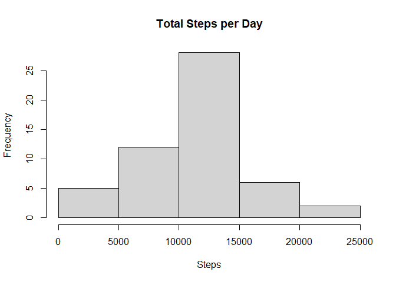

## Loading and preprocessing the data

```r
library(plyr)
library(ggplot2)

unzip("activity.zip")
```

## Reading csv Data into Data.Table. 

```r
activity <- read.csv("activity.csv")
#summary(activity)

activity$day <- weekdays(as.Date(activity$date))
activity$DateTime<- as.POSIXct(activity$date, format="%Y-%m-%d")

##pulling data without nas
clean <- activity[!is.na(activity$steps),]
```

## What is mean total number of steps taken per day?

```r
## summarizing total steps per date
sumTable <- aggregate(activity$steps ~ activity$date, FUN=sum, )
colnames(sumTable)<- c("Date", "Steps")

## Making a histogram of total number of steps taken per day
hist(sumTable$Steps, breaks=5, xlab="Steps", main = "Total Steps per Day")
```

<!-- -->

```r
## Mean of Steps
mean_steps <- as.integer(mean(sumTable$Steps))
mean_steps
```

```
## [1] 10766
```

```r
## Median of Steps
median_steps <- as.integer(median(sumTable$Steps))
median_steps
```

```
## [1] 10765
```
- Average number of steps taken per day is `mean_steps`
- Median number of steps taken per day is `median_steps`

## What is the average daily activity pattern?


## Imputing missing values


## Are there differences in activity patterns between weekdays and weekends?
